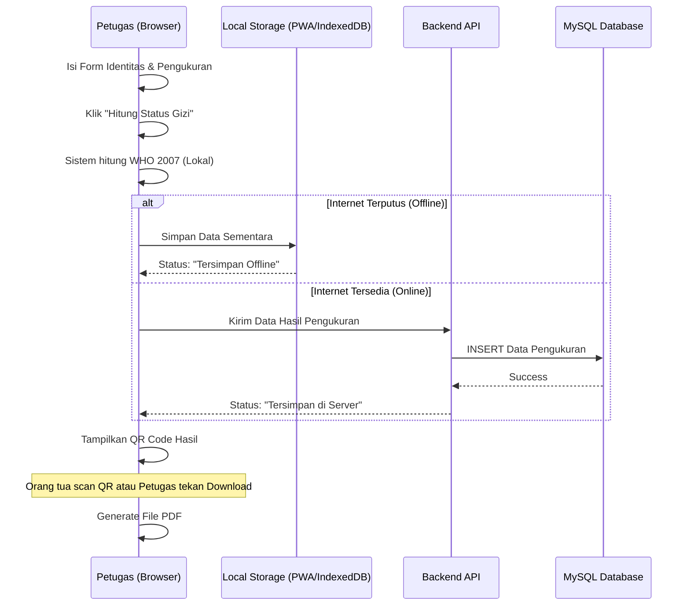
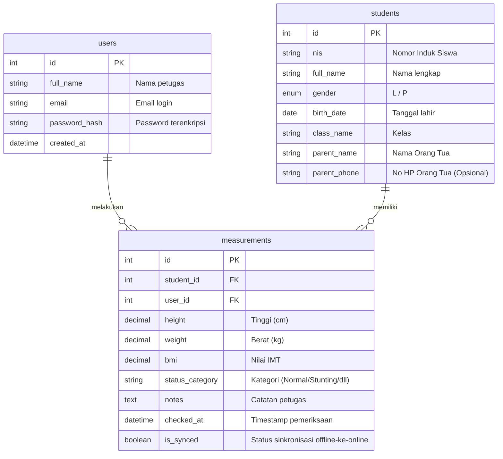

# PRD — Project Requirements Document

## 1. Overview
Aplikasi ini adalah platform berbasis web (berkemampuan *hybrid/offline*) yang dirancang untuk membantu sekolah (petugas UKS/guru) dalam memantau dan mencatat status gizi siswa. Dengan menggunakan standar perhitungan **WHO 2007**, sistem ini memecahkan masalah pencatatan manual dengan memberikan otomasi perhitungan Indeks Massa Tubuh (IMT), penentuan status gizi (Normal, Obesitas, Stunting, dll.), serta memberikan rekomendasi kesehatan instan.

Tujuan utama sistem ini adalah menghadirkan alur kerja yang cepat dan praktis bagi petugas pemeriksa, sekaligus memudahkan pelaporan kepada orang tua melalui fitur unggulan berupa *Scan QR Code* yang langsung mengunduh hasil pemeriksaan dalam format PDF.

## 2. Requirements
- **Platform:** Aplikasi Web Browser yang kompatibel dengan berbagai perangkat (Desktop, Tablet, Mobile).
- **Konektivitas (Hybrid):** Sistem harus bisa digunakan secara *offline* (tanpa internet) saat melakukan pemeriksaan di lapangan, dan akan melakukan sinkronisasi otomatis ke server saat internet kembali tersedia.
- **Standar Medis:** Perhitungan algoritma status gizi mutlak menggunakan rujukan kurva pertumbuhan **WHO 2007**.
- **Lingkup (Scope):** Terbatas untuk 1 (satu) entitas sekolah.
- **Akses Orang Tua:** Orang tua tidak perlu login/membuat akun. Mereka cukup meng-scan QR Code yang ditunjukkan petugas untuk mengunduh dokumen pelaporan (PDF).
- **Infrastruktur Data:** Menggunakan database rasional **MySQL** sesuai permintaan khusus.

## 3. Core Features
- **Autentikasi Petugas:** Halaman login aman untuk guru/admin UKS.
- **Dashboard Interaktif:** Menampilkan ringkasan data gizi sekolah secara waktu nyata (jumlah anak diperiksa, statistik status gizi berupa grafik, dan peringatan visual untuk kasus stunting/obesitas).
- **Manajemen Data Anak:** Formulir pendataan identitas siswa mencakup Nama, NIS, Jenis Kelamin, Tanggal Lahir (perhitungan umur otomatis), dan Kelas.
- **Modul Pengukuran & Kalkulator Gizi:** Input input angka interaktif (Tinggi Badan & Berat Badan) yang langsung diproses oleh sistem untuk menghasilkan status gizi berdasarkan WHO 2007. Menampilkan *loading screen* modern saat proses kalkulasi.
- **Halaman Hasil & Rekomendasi:** Menampilkan hasil akhir secara visual (warna hijau untuk normal, merah obesitas, kuning stunting) beserta saran kesehatan otomatis berdasarkan hasil.
- **Generator QR Code & Export PDF (Fitur Unggulan):** Sistem secara otomatis membuat QR Code di halaman hasil. Saat QR ini di-scan (atau tombol PDF ditekan), sistem menghasilkan file PDF laporan gizi yang rapi untuk dibagikan ke orang tua wali.

## 4. User Flow
1. **Login:** Petugas membuka web di browser dan login menggunakan kredensial (Email/Password).
2. **Dashboard:** Petugas melihat ringkasan data hari ini, lalu menekan tombol besar "Mulai Pemeriksaan".
3. **Input Identitas:** Petugas mencari data anak yang sudah ada atau memasukkan data anak baru (Nama, Kelas, Tanggal Lahir).
4. **Input Pengukuran:** Petugas menimbang dan mengukur anak, lalu memasukkan angka Berat Badan dan Tinggi Badan ke dalam sistem.
5. **Kalkulasi:** Petugas menekan "Hitung Status Gizi". Sistem menampilkan animasi proses singkat.
6. **Lihat Hasil:** Sistem menampilkan status gizi anak beserta rekomendasinya secara instan.
7. **Bagikan Laporan (Share):** Petugas menunjukkan QR Code di layar kepada orang tua untuk di-scan, yang akan mengunduh lembar PDF hasil pemeirksaan anak tersebut, lalu petugas menekan "Simpan Data" untuk menyelesaikan alur.

## 5. Architecture
Karena aplikasi ini bersifat **Hybrid (Offline-First)**, akses saat pertama kali memuat halaman akan mengandalkan teknologi PWA (Progressive Web App). Data saat internet terputus akan disimpan di memori browser lokal (*IndexedDB*) dan disinkronkan ke Backend (dan MySQL) saat koneksi pulih.

## 6. Database Schema
Berbasis **MySQL**, berikut adalah struktur tabel untuk mengakomodasi aplikasi satu sekolah ini.

### Daftar Tabel
1. **users (Petugas):** Menyimpan data otentikasi petugas/guru pemeriksa.
2. **students (Siswa):** Menyimpan identitas demografis anak.
3. **measurements (Pemeriksaan):** Menyimpan riwayat setiap kali anak diukur lengkap dengan hasil kalkulasinya.

## 7. Tech Stack
Untuk mencapai target web aplikasi yang hybrid, modern, dan menggunakan database *MySQL*, berikut adalah rekomendasi teknologinya:

- **Frontend & Backend (Fullstack):** **Next.js** (App Router). Sangat cocok untuk membangun web modern secara utuh, plus kemudahan membuat layout PWA untuk fitur offline.
- **Styling & UI Components:** **Tailwind CSS** dipadukan dengan **shadcn/ui** untuk tampilan yang bersih, input form yang besar, dan interaktif dengan usaha (waktu) yang minimal.
- **Offline Storage Management:** **Dexie.js** (Wrapper untuk IndexedDB) untuk menyimpan data pemeriksaan sementara di browser ketika koneksi internet hilang.
- **Database:** **MySQL** terhubung ke Next.js menggunakan **Drizzle ORM** (canggih, cepat, dan modern untuk skema relasional).
- **Kalkulator Status Gizi:** Fungsi Javascript kustom dengan algoritma standar tabel z-score **WHO 2007**.
- **Generator PDF & QR:** **react-qr-code** untuk menampilkan QR di layar, dan **html2pdf.js** atau **@react-pdf/renderer** untuk men-generate layout web hasil pemeriksaan langsung menjadi file PDF tanpa membebani server.